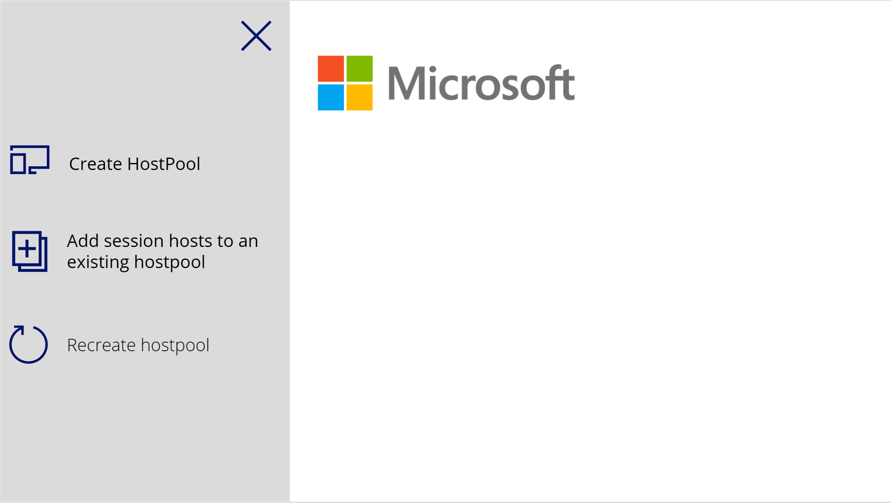
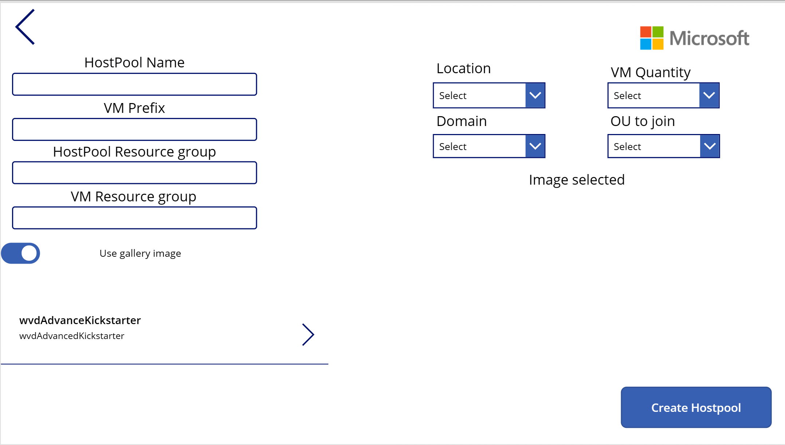
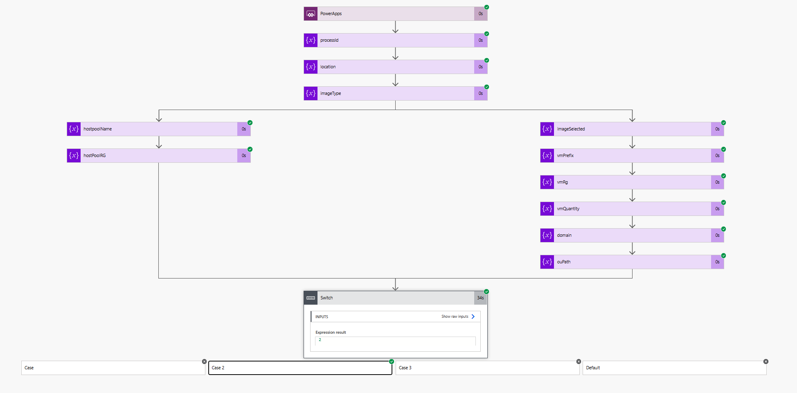
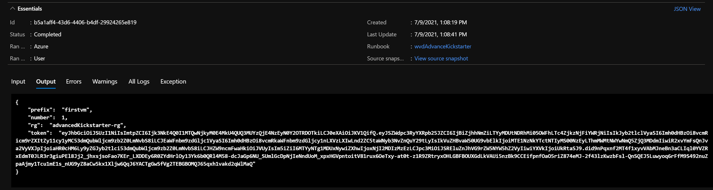

# AVD Advanced Kickstarter

There are multiple ways to deploy AVD. The most common can be thought the portal, but when we think about automation is not that scalable. 

Is it possible to handle the deployment of AVD to another team? How can we worry about the infraestructure and not about the actual deployment?

This kickstarter will guide you thought an automation proces of how to deploy AVD using:

1. [Azure DevOps](#DevOps)
    - [Repos](#Repos)
    - [Release pipelines](#Release-Pipeline)
        - [Tasks](#Tasks)
        - [Parameters](#Parameters)
1. [PowerPlatform](#PowerPlatform)
    - [PowerApps](#PowerApps)
    - [PowerAutomate](#PowerAutomate)
1. [Azure Services](#Azure%20Services)
    - [Key vault](#Key-Vault)
    - [Automation Accounts](#Automation-Accounts)
    - [Storage Accounts](#Storage-Accounts)

***

## DevOps

On this framework, DevOps is the core software. It will be used to mantain the Repo and to orquestrate the deployment into Azure.

### Repos

Repos are the handler of the ARM templates. The team will maintain the templates here and everytime a new deployment comes, the latest version of these temapltes will be used. 

The repo is structured in the following way

> To create a brand new hostpool

- Create new hostpool 
    - parameters
        - createNewHostpool.parameters.json
    - createNewHostpool.json

> To add more session hosts into an existing hostpool

- Add more session hosts
    - parameters
        - addMoreSessionHosts.parameters.json
    - addMoreSessionHosts.json
    
> The VM templates for the deployment

- nestedTemplatess
    - managedDisks-galleryvm.json
    - managedDisks-galleryvm.json

### Release Pipeline

Release pipelines are the reposable of deploying into Azure. Depending on the action, we have 2 pipelines

- New hostpool
- Add session hosts

Each pipeline has the same tasks inside, but the **parameters** that they need to run is different. 

#### Tasks

To deploy into Azure, the pipeline does 3 steps

1. Fetch from Key Vault the "Join Domain Password".
1. Copy into a temp storage account. This step is needed since we are working with nested templates. 
1. Deploy the ARM template with the provided parameters. 

#### Parameters

On the "Deploy into Azure" task, the parameters template in the repo has some default settings, but what if we do want to add more flexibility into de deployment? If we want to add the Hostpool name for example without the need of changing everytime the parameters template.

Introducing *Release Pipeline Variables*. This variables will be inputed into the pipeline and also passed into the ARM deployment. 

These variables will be used on the deployment task to override the default parameters in the ARM template and pass some dynamic content.
On the deployment task of DevOps, we can see the "Override template parameters" In here we will replace the defult parameters with some dyncamic content.

***

## PowerPlatform

PowerPlatform can be used as a UI and also as the orquestrator behind all this solution. If PowerPlatform is not a viable solution for you, there is a workarround with Azure LogicApps that can be integrated with other UIs like Office365 Forms or any service that can trigger a REST call into LogicApps.

### PowerApps

PowerApps is used as a UI. Since is a Low-Code solution, the maintain effort is low and the customization is quick. 

#### PowerApps

PowerApps will be our UI for the automation in this framework. It will help answer questions like "Can I delegate a part of the deployment without compromise security and policies?"

> If a new requirement or if a change in the UI is needed, can be done with **minimum effort**

### PowerAutomate

Behind the UI, a flow is running to get all the input from the PowerApp and build the logic for the deployment. Do we need to select a VM size according the domain the VM is joining? Do we need an specific VM prefix according to the image  we select? All of this can be achieve with flow and following the same principal of PowerApps.

> If a new requirement or if a change in the UI is needed, can be done with **minimum effort**

***

## Azure Services

### Key Vault

In order to keep secrets on the deployment, Key Vault is use to store the Join Domain Password and can be used for extra secrets that the deployments needs. 

### Automation Accounts

When whe depoloy a brand new hostpool, is the user that provides all the parameters. But what happens when we need to deploy to an existing hostpool? Can the user remember the hostpool token? Unless the user has an awesome memory, I don't think so. That's why Automation Accounts will do the job for us. 

This script can be found in [here](/PsScripts/hostpoolManagement.ps1). This script will go an fetch the information from AVD service and return the information that is needed for the deployment. 

### Storage Accounts

The Storage Accounts are just a temp space to storage the ARM templates that are going to be needed by Azure when the nested template deployment is called. The storage account is used by DevOps on the [Release Pipeline](#Release-Pipeline)