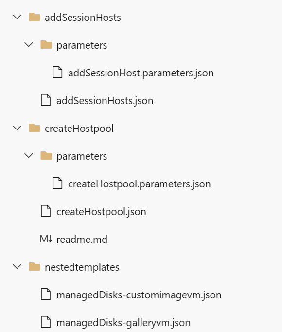
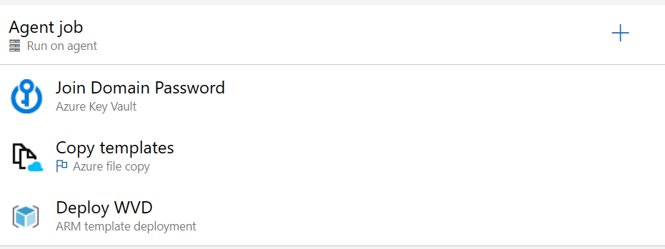
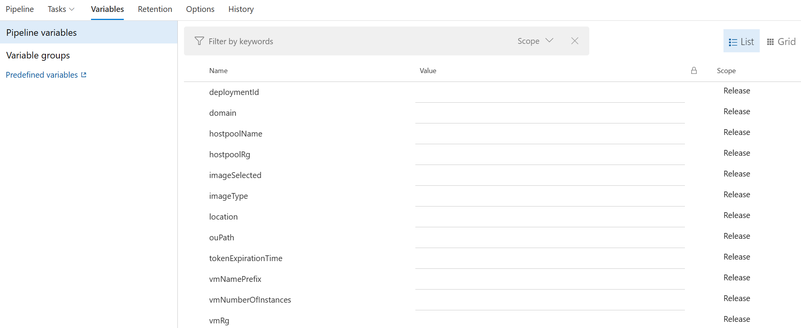
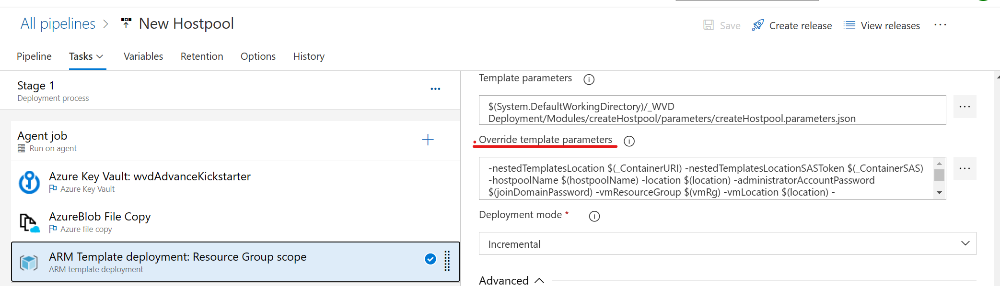

# AVD Advanced Kickstarter

There are multiple ways to deploy AVD. The most common can be thought the portal, but when we think about automation is not that scalable. 

Is it possible to handle the deployment of AVD to another team? How can we worry about the infraestructure and not about the actual deployment?

This kickstarter will guide you thought an automation proces of how to deploy AVD using:

1. [Azure DevOps] (#DevOps)
1. PowerPlatform
    - PowerApps
    - PowerAutomate
1. Azure Services
    - Key vault
    - Azure Automation
    - Storage Accounts

## DevOps

On this framework, DevOps is the core software. It will be used to mantain the Repo and to orquestrate the deployment into Azure.

### 1. Repos

Repos are the handler of the ARM templates. The team will maintain the templates here and everytime a new deployment comes, the latest version of these temapltes will be used. 

The repo is structured in the following way

> To create a brand new hostpool

- Create new hostpool 
    - parameters
        - createNewHostpool.parameters.json
    - createNewHostpool.json

> To add more session hosts into an existing hostpool

- Add more session hosts
    - parameters
        - addMoreSessionHosts.parameters.json
    - addMoreSessionHosts.json
    
> The VM templates for the deployment

- nestedTemplatess
    - managedDisks-galleryvm.json
    - managedDisks-galleryvm.json

### 2. Release Pipeline

Release pipelines are the reposable of deploying into Azure. Depending on the action, we have 2 pipelines

- New hostpool
- Add session hosts

Each pipeline has the same tasks inside, but the **parameters** that they need to run is different. 

#### 2.1 Tasks

To deploy into Azure, the pipeline does 3 steps

1. Fetch from Key Vault the "Join Domain Password".
1. Copy into a temp storage account. This step is needed since we are working with nested templates. 
1. Deploy the ARM template with the provided parameters. 

#### 2.2 Parameters

On the "Deploy into Azure" task, the parameters template in the repo has some default settings, but what if we do want to add more flexibility into de deployment? If we want to add the Hostpool name for example without the need of changing everytime the parameters template.

Introducing *Release Pipeline Variables*. This variables will be inputed into the pipeline and also passed into the ARM deployment. 

These variables will be used on the deployment task to override the default parameters in the ARM template and pass some dynamic content.
On the deployment task of DevOps, we can see the "Override template parameters" In here we will replace the defult parameters with some dyncamic content.

